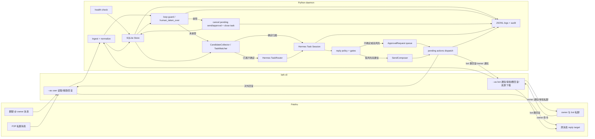
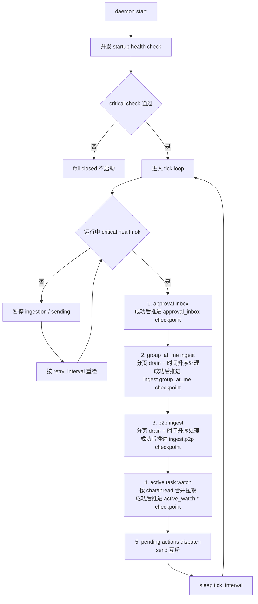
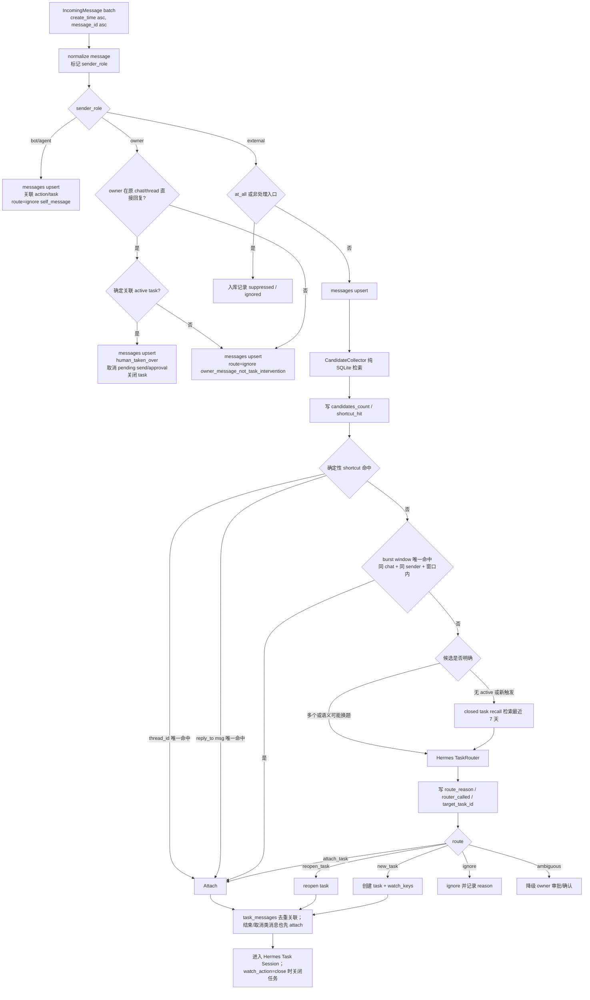
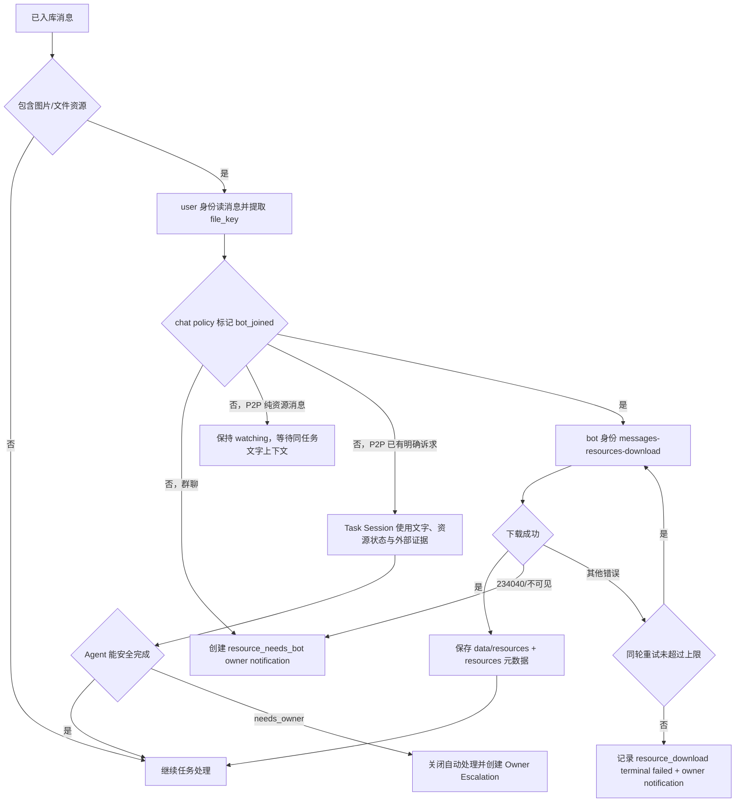
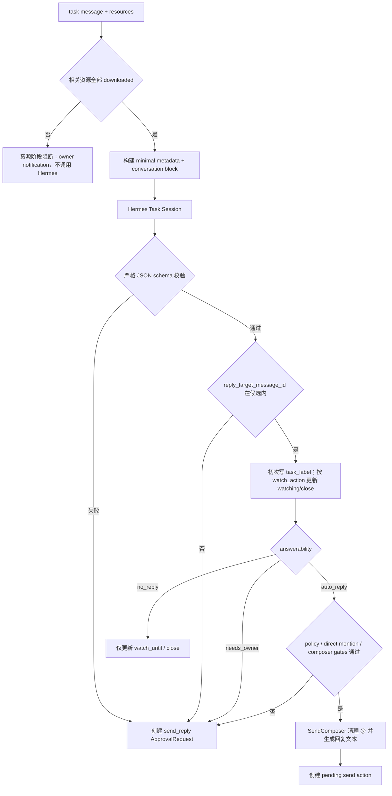
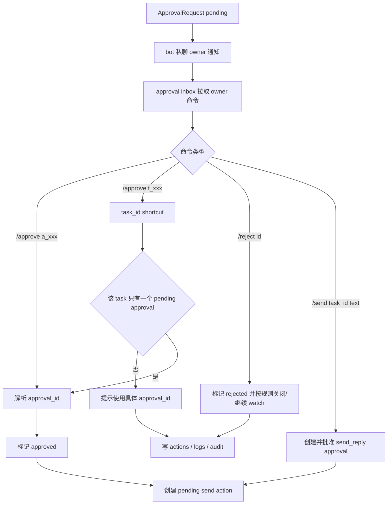
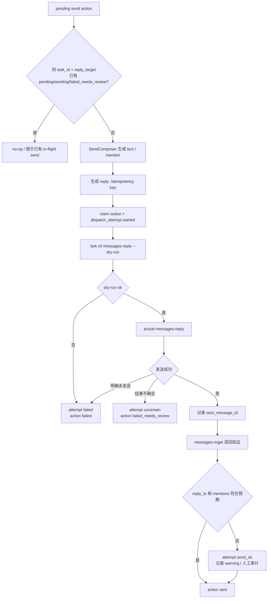

# Feishu Shadow Agent MVP 流程图

本文是 [MVP 设计](./feishu-shadow-agent-mvp-design.md) 的 Mermaid 流程图补充。主 spec 描述约束和规则；本文只沉淀数据如何在系统里流动，以及关键子流程如何闭环。

## 1. 整体数据流程

## 2. Daemon tick 流程

## 3. 消息进入与任务归属

## 4. 资源下载与 bot gate

## 5. Hermes 处理与回复决策

## 6. 审批与手动发送

## 7. 幂等发送与读回验证

stale `sending` 不自动重发；下次 dispatch 检测到超时 in-flight action 时，将 action 标记为 `failed_needs_review`，并保留原 idempotency key 供本地恢复 CLI 人工处理。`failed_needs_review` 继续占用 active-send 约束，直到 operator `mark-sent`、`retry` 复用原 action/idempotency key，或 `cancel` 释放约束。
